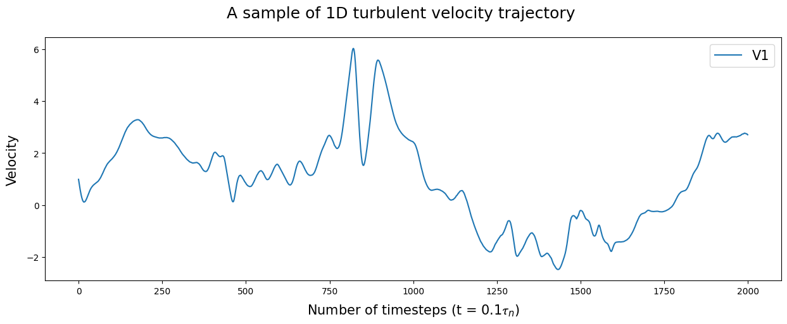
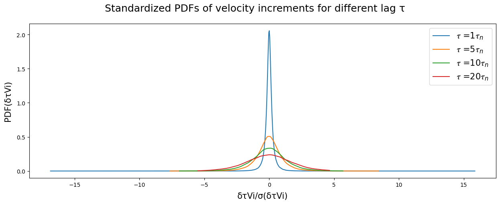
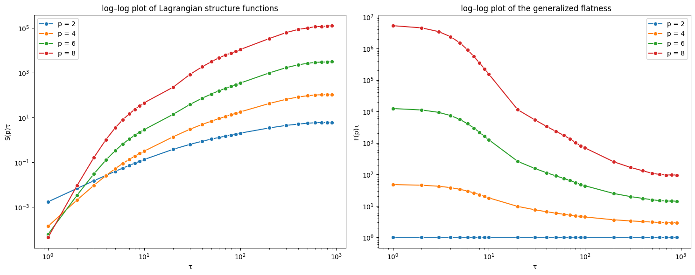
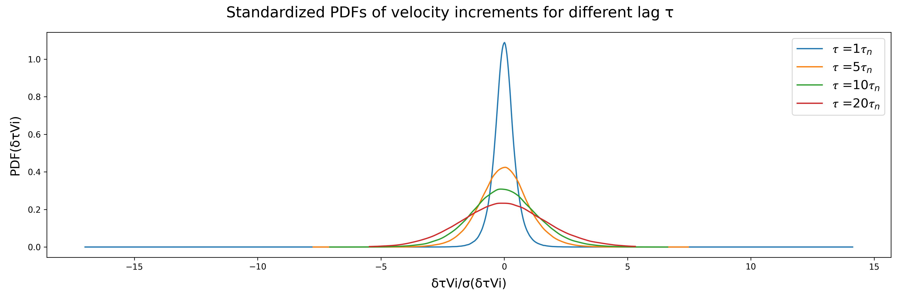
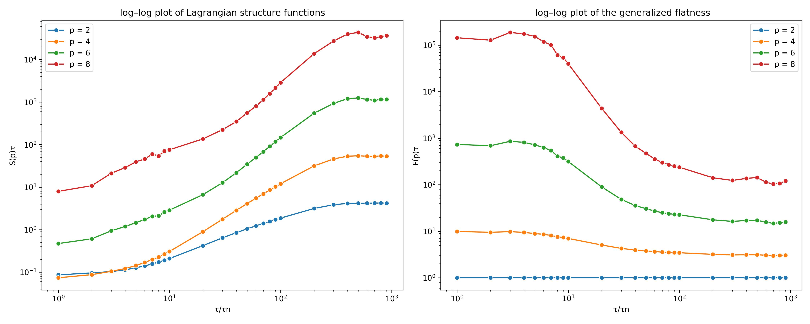

# **Project Overview**

This repository provides the implemented code for the **Recent Advances in Machine Learning course project**, as part of the **MEng in Computer Science program at IMT Atlantique**.

The goal of this project is to explore and analyze how **Denoising Diffusion Probabilistic Models (DDPM)** can be used as an efficient alternative to costly Direct Numerical Simulations (DNS) for generating stochastic processes that preserve the **key multi-scale statistics** and **intermittent behavior** of turbulent flows.

# **Installation**

```bash
# Clone the repository
git clone https://github.com/JLiOngit/Diffusion-model---Generation-of-turbulence-time-series.git
cd Diffusion-model---Generation-of-turbulence-time-series

# Install dependencies
pip install -r requirements.txt
```

# **Running**

The project enables to :
- Train the 1D U-Net diffusion model (`--action = only_training`)
- Generate synthetic turbulent trajectories (`--action = only_sampling`), once you have a model which has been trained and stored in `trained_model/`
- Perform both sequentially (`--action = training_and_sampling`).

Configuration parameters are defined in `ddpm/main.py` (class `Config`). Training and sampling parameters (`BATCH_SIZE`, `LEARNING_RATE`, `NUM_SAMPLES`, etc.) can also be overridden via CLI arguments.

```bash
python -m ddpm.main [OPTIONS]
```

### Arguments

| Argument | Type | Default | Description |
|---|---|---|---|
| `--action` | `str` |`training_and_sampling` | `only_training`, `only_sampling`, or `training_and_sampling` |
| `--num_diffusion` | `int` | `800` | Number of diffusion steps |
| `--schedule_name` | `str` | `linear` | Beta schedule name |
| `--batch_size` | `int` | `32` | Batch size |
| `--lr` | `float` | `1e-4` | Learning rate |
| `--weight_decay` | `float` | `1e-2` | Weight decay |
| `--ema_rate` | `float` | `0.97` | EMA rate |
| `--loss_type` | `str` | `mse` | Loss type (`mse` or `kl`) |
| `--num_train` | `int` | `500` | Number of training steps |
| `--num_validation` | `int` | `25` | Number of validation steps |
| `--num_samples` | `int` | `500` | Number of samples to generate |

# **Analysis**

## Dataset

The research paper uses turbulent Lagrangian trajectories extracted from a "high-resolution Direct Numerical Simulation (DNS) of the three-dimensional incompressible Navier–Stokes equations in a cubic, periodic domain with homogeneous isotropic forcing, once statistical stationarity had been reached".

A subset of **768 one-dimensional (1D) turbulent velocity trajectories** was made publicly available and used in our implementation. Each trajectory represents the time evolution of a single velocity component of a tracer particle in the turbulent flow. 

Each trajectory was sampled at a temporal resolution of $\Delta t \simeq 0.1\,\tau_\eta
$ where $\tau_\eta$ is the Kolmogorov time scale. This corresponds to **2,000 time steps per trajectory**, corresponding to $T \simeq 200\,\tau_\eta$ of Lagrangian evolution.



## Turbulence properties

### 1. The Probability density function of increments

The Probability Density Function (PDF) of velocity increments  $\delta_\tau u = u(+\tau) - u(t)$ measures the likelihood of observing a given change in velocity over a time lag $\tau$.



The shape of the PDF changes with the scale $\tau$:
- **Large scales $\tau$**: the PDF is close to Gaussian so velocity variations are relatively smooth and predictable.
- **Small scales $\tau$**: the PDF develops *fat tails* indicating that extreme events (strong, sudden accelerations) occur far more frequently than in a purely random Gaussian process. This phenomenon is known as **intermittency**

### 2. Lagrangian Structure Functions

The **structure function of order p** defined as $S_p(\tau) = \langle [\delta_\tau u]^p \rangle$ quantifies the magnitude of velocity fluctuations across scales, capturing the **energy distribution** and **multi-scale correlations** of turbulence. $\tau$. 
For $p=2$, $S_2(\tau)$ represents the energy associated with fluctuations at scale $\tau$.

### 3. Generalized Flatness

The **generalized flatness of order \(p\)** defined as $F_p(\tau) = \frac{S_p(\tau)}{[S_ (\tau)]^{p/2}}$ measures the **degree of intermittency**: how much the distribution of increments deviates from Gaussian behavior. Large $F_p(\tau)$ at small $\tau$ indicates frequent **extreme events** and **strong small-scale turbulent bursts**.




## Results

Diffusion models are a class of generative models that learn to generate data by reversing a gradual noising process. They work by:
1. **Forward process**: Adding Gaussian noise to data until it becomes pure noise
2. **Reverse process**: Learning to denoise, step by step, from pure noise back to data

### 1. Forward Diffusion Process

The forward process gradually corrupts data $x_0$ by adding Gaussian noise over $T$ timesteps.

$$q(x_{1:T} | x_0) := \prod_{t=1}^{T} q(x_t | x_{t-1})$$

where each step adds noise:

$$q(x_t | x_{t-1}) := \mathcal{N}(x_t; \sqrt{1 - \beta_t} x_{t-1}, \beta_t I)$$

**With key parameters:**
- $\beta_t$: Variance schedule controlling noise added at step $t$
- $T$: Total diffusion steps

We defined and displayed different variance schedulers. 
We decided to use a **linear scheduler** and **T = 800 diffusion step**s after few experiences showing a lower loss from the model


This reflects **how information gradually dissipates**. In addition, we displayed the evolution of the time series and its statistical properties at different diffusion steps in order to visualise the forward process of the diffusion model.


### 2. Reverse Denoising Process
The generative model learns to reverse the diffusion by approximating the conditional distribution $q(x_{t-1} | x_t)$. We use a learned model $p_\theta$:

$$p_\theta(x_{t-1} | x_t) = \mathcal{N}(x_{t-1}; \mu_\theta(x_t, t), \Sigma_\theta(x_t, t))$$

In our implementation, the 1D U-Net is trained to predict the noise $\epsilon_\theta$ added at step $t$. More precisely, the training objective (loss function) is to minimize the difference between the true noise $\epsilon$ and the predicted noise $\epsilon_\theta$. This is equivalent to **denoising score matching**:

$$L_{simple}(\theta) = \mathbb{E}_{t, x_0, \epsilon} \left[ \left\| \epsilon - \epsilon_\theta(x_t, t) \right\|^2 \right]$$


Once the model is trained, we can generate new turbulent trajectories by **starting from pure Gaussian noise** and iteratively applying the reverse diffusion process. 

At each step t, assuming that the standard deviations of the reverse and forward processes are identical ($\Sigma_\theta(x_t, t) = \beta_tI$), the model predicts **the mean of the previous trajectory $x_{t-1}$** conditioned on the current noisy trajectory $x_t$ and the time step t. The update rule is given by:

$$\mu_\theta(x_t, t) = \frac{1}{\sqrt{\alpha_t}} \left( x_t - \beta_t \frac{\epsilon_\theta(x_t, t)}{\sqrt{1 - \bar{\alpha}_t}} \right)$$

The update step also adds stochasticity:

$$x_{t-1} = \mu_\theta(x_t, t) + \beta_t \mathbf{z}, \quad \mathbf{z} \sim \mathcal{N}(0, \mathbf{I})$$

We show the backward diffusion process at different steps, illustrating how the model progressively removes noise to generate realistic turbulent trajectories.


Although the model is able to generate trajectories from pure Gaussian noise, some residual noise remains in the final samples. Further modifications and experiments could be explored to improve the model's performance.

A total of **500 trajectories were generated**. These trajectories are used to compute the previously turbulence metrics and to evaluate how well the model reproduces the key characteristics of the turbulent flow.





# **Reference**

[1] Li, T., Biferale, L., Bonaccorso, F., Scarpolini, M. A., & Buzzicotti, M. (2024). Synthetic Lagrangian turbulence by generative diffusion models.


